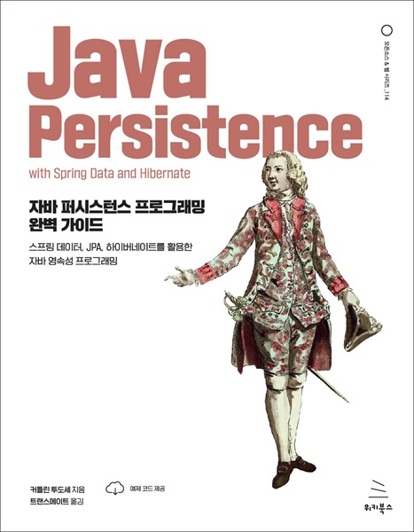

# 자바 퍼시스턴스 프로그래밍 완벽 가이드
### 스프링 데이터, JPA, 하이버네이트를 활용한 자바 영속성 프로그래밍

- **커틀린 투도세** 지음 | **트랜스메이트** 옮김
- ISBN: 9791158394769
- 판형: 188\*240\*30mm
- 48,000원 | 2024년 2월 22일 발행 | 728쪽
- [책 홈페이지](https://wikibook.co.kr/javapersistence/)
- [도서 미리보기](http://www.yes24.com/Product/Viewer/Preview/124899724)
- [도서 관련 문의](https://wikibook.co.kr/support/contact/)

---

애플리케이션 데이터를 효과적으로 관리하는 것은 모든 애플리케이션에 필수적입니다. 스프링 데이터와 하이버네이트는 객체지향 코드와 관계형 데이터 저장소 간의 격차를 줄여 자바 영속성 프로그래밍을 획기적으로 간소화합니다.

《자바 퍼시스턴스 프로그래밍 완벽 가이드》는 스프링 데이터, JPA, 하이버네이트를 이용한 실습 예제를 통해 자바 영속성을 자세히 다룹니다. 이 책은 주요 자바 영속성 도구의 기능을 면밀히 분석하고 가장 일반적인 사용 사례를 안내합니다. 각 도구를 비교, 대조함으로써 애플리케이션에 어떤 도구가 적합한지 선택할 수 있습니다. 매핑 전략을 만들고 활용하는 방법, 하이버네이트와 스프링 데이터의 트랜잭션 접근 방식, 자바 영속성 애플리케이션을 효율적으로 테스트하는 방법까지 배울 수 있습니다. 관계형 데이터베이스와 비관계형 데이터베이스를 모두 활용하는 예제도 제시합니다.

**★ 이 책에서 다루는 내용 ★**

- 영속 클래스, 값 타입, 상속 매핑
- 컬렉션과 엔티티 연관관계 매핑
- 스프링 데이터와 하이버네이트를 이용한 트랜잭션 처리
- 페치 계획, 전략, 프로파일
- 데이터 필터링
- 스프링 데이터 REST 프로젝트 구축
- 비관계형 데이터베이스에서 자바 영속성 활용
- QueryDSL을 이용한 JPA 쿼리
- 자바 영속성 애플리케이션 테스트

---
 
 ## 구입처
 
 - [예스24](https://www.yes24.com/Product/Goods/124899724)
 - [교보문고](https://product.kyobobook.co.kr/detail/S000212236456)
 - [인터파크](https://book.interpark.com/product/BookDisplay.do?_method=detail&sc.prdNo=356869045)
 - [알라딘](https://www.aladin.co.kr/shop/wproduct.aspx?ItemId=333600610)